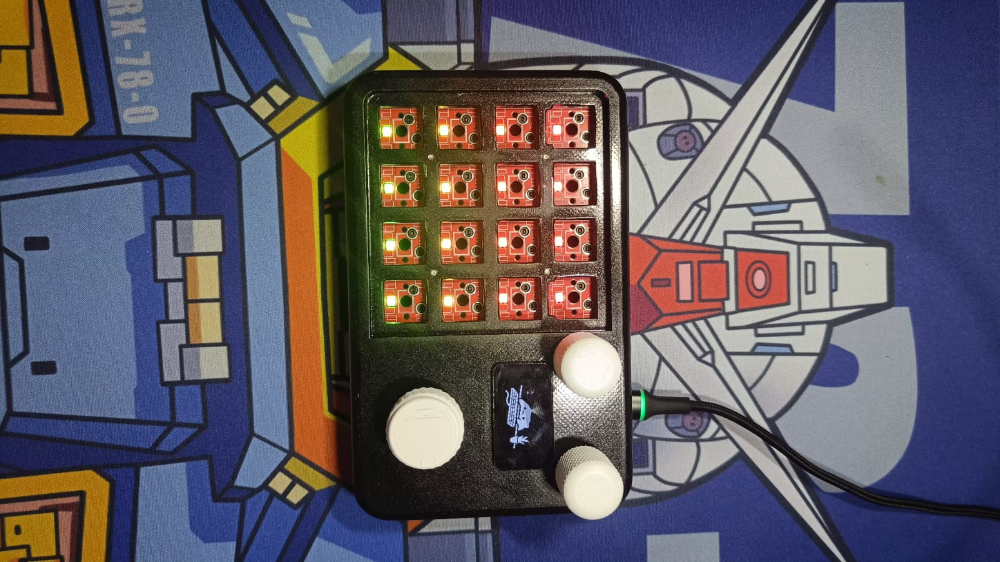
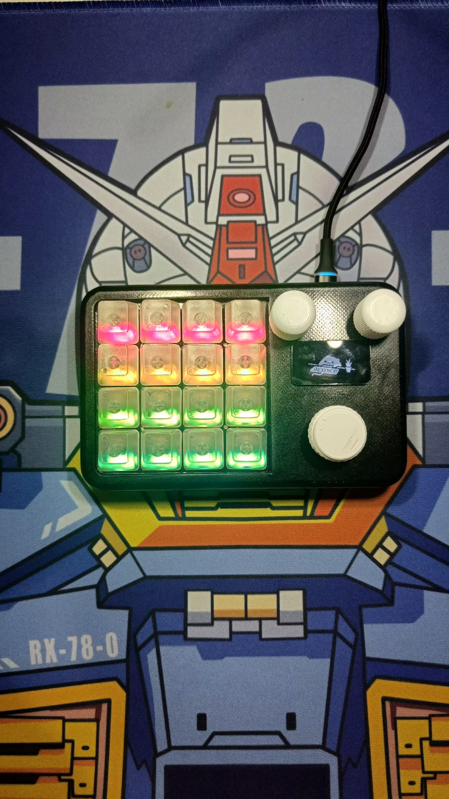

# Zeapad-Pro-QMK-VIA
This is Macropad that have function like keyboard but you can setting/proggrammed every single key with anything you want. This macropad also have feature MACRO, it mean you just need prees a single swith for Combination Key. All Function can be setting in Apps named VIA. Then you can buy it in this [TOKOPEDIA](https://tokopedia.link/nYgWruHWJHb) 
Many people use it for help they for Computer Task Like Edithing Vidio or Excel Formula shortcut

## Spesification
- STM32F401 as Microcontroller
- QMK Firmware
- Support VIA, all key and knob can proggrammed
- RGB Matrix
- 4x Layer 
- 16x Switch , 3 Knob Encoder and 1 OLED LAyer
- Hotswap Switch
- 3D Case 
- USB type C

## Download VIA
Link Download VIA(CHOSEE BASED YOUR OS) : https://github.com/the-via/releases/releases
VIA WEB VERSION : https://usevia.app/

## Auto Detect VIA
this Device can automatically detect on VIA, just need PC with Intercet Connection
- Connect your macropad to PC
- Open VIA
- It will auto detect
## load JSON File
or you can load manually json file like a library for detect this macropad
- Connect your macropad to PC
- Open VIA
- In Tab Setting, enable "Show Design Tab"
- Open Design Tab
- Load file with name "zeapad_via_definitions.json" 
- Open Configure Tab to setting your macropad
- If nothing happend , do it again from first 

## Preview Hardware

  
  

## Preview VIA

https://github.com/juarendra/Zeapad-Pro-QMK-VIA/assets/43043633/afd7e68e-0a54-4b18-be12-b96c0f13611a

## Link Keycode QMK
- mouse : https://github.com/qmk/qmk_firmware/blob/master/docs/feature_mouse_keys.md
- keyboard : https://github.com/qmk/qmk_firmware/blob/master/docs/keycodes.md

## Tutorial VIA Usage
- https://docs.keeb.io/via

## Cara Setting Knob
- For Setting Knob you just need enter the command qmk keycode, so the way is same thing with setting for ANY key like in this guide:]
[GUIDE FOR Setting ANY KEY](https://docs.keeb.io/via)

Here's some examples:

- LALT(KC_TAB) - Sends Alt-Tab
- LCTL(KC_C) - Sends Ctrl-C
- LGUI(KC_C) - Sends Cmd-C or Win-C
- LSFT(LCTL(KC_END)) - Sends Shift-Ctrl-End
- MO(1) - Momentarily turn on layer 1
- LCA(KC_DEL) - Sends Ctrl-Alt-Del
- MT(MOD_RSFT, KC_ENT) - Sends Shift if held, Enter if tapped
- MACRO (0) - Macro 0

## Cara Update/Upgrade Firmware
- Siapkan dahulu macropad, kabel usb dan firmware yang ingin di update/upgrade ke macropad anda
- Siapkan Firmware yang akan digunakan untuk update/upgrade
- Download Software QMK Toolbox di [link berikut](https://github.com/qmk/qmk_toolbox/releases)
- Install Software QMK Toolbox, Install Semua drivernya. setelah siap anda dapat meload Firmware yang seblumnya. Lalu Centang 
- Colok kabel ujung usb type C ke macropad tanpa mencolokannya dahulu ke USB PC anda
- Tekan dan tahan tombol yang berada di ujung atas kiri. lalu colokan Ujung USB yang sebelum ke USB PC anda sambil tetap menahan tombol sebelum nya sebentar
- Setelah ada bunyi/notif USB masuk. anda dapat melepaskan tombol knobnya
Lalu akan muncul drive baru di "my computer" anda seperti gambar dibawah
lalu copy file firmware yang sudah di download sebelumnya ke drive baru tersebut
setelah selesai copynya maka macropad secara otomatis akan tereset
anda dapat mengetesnya

